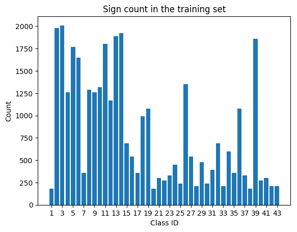
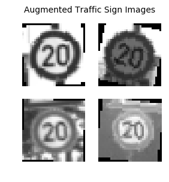
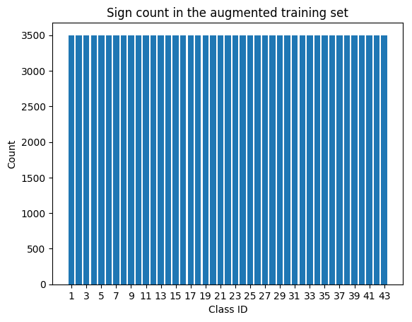
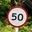

# Traffic Sign Classification Project
The steps of this project are the following:
* Load the data set
* Explore, summarise and visualize the data set
* Design, train and test a model architecture
* Use the model to make predictions on new images
* Analyse the softmax probabilities of the new images
* Summarise the results

---

### Dataset summary and exploration
#### A basic summary of the dataset
I used the pandas library to calculate summary statistics of the traffic
signs dataset:

* Number of training examples: __34799__
* Number of validation examples: __4410__
* Number of test examples: __12630__
* Shape of a traffic sign image: __32x32x3__
* Number of unique classes: __43__

#### Visualising the dataset
This histogram shows the distribution of images across the traffic sign classes. Each bar represents one of the 43 unique image class IDs. Some classes are better represented than others in this dataset.



---

### Data preprocessing
All images in the dataset are converted to grayscale. This reduces the size and complexity of the input data and thus benefits from an increase in computational efficiency. Colour information is lost however, so the model might not predict as accurately had we trained it using colour images, and it might not generalise as well.

Rotated versions of the original images are added to the dataset by selecting uniquely random angles between -20 to 20 degrees and applying the rotation to random images from a given class, until that class contains 3500 images.

```python
for i in range(n_classes):
    num_more_images = 3500 - np.sum(y_train == i)
    angles = np.random.random_sample(num_more_images)*30-15
    X_more = []
    y_more = []
    for j in range(num_more_images):
        rotated = rotate_image(X_train[random.choice(class_indices[i])], angles[j])
        X_more.append(rotated)
        y_more.append(i)
    X_train = np.concatenate((X_train, X_more), axis=0)
    y_train = np.append(y_train, y_more)
```



This brings the following benefits,
1. Providing more data, and more varied data, allows the model to generalise better when predicting new, previously unseen images
2. The distribution of data is normalised such that each class is equally represented, meaning the model's ability to predict the class of a new image won't be biased towards any one class



---

### Model architecture
The model is based on the LeNet-5 architecture.

The filter sizes on the convolution layers are larger compared to LeNet-5, as the features in the images make up a large proportion of the image. A small filter size would miss some of these important features.

Dropout layers have also been added to reduce the chance of overfitting.

My model consists of the following layers:

| Layer | Description |
|:---:|:---|
| Input | 32x32x1 grayscale image |
| Convolution 7x7 | 1x1 stride, valid padding, outputs 26x26x6 |
| RELU | |
| Dropout | 0.75 probability|
| Max pooling | 2x2 stride, outputs 13x13x6 |
| Convolution 6x6 | 1x1 stride, valid padding, outputs 8x8x16 |
| RELU | |
| Dropout | 0.75 probability |
| Max pooling | 2x2 stride, outputs 4x4x16 |
| Fully connected | flattened, outputs 120 |
| RELU | |
| Dropout | 0.75 probability |
| Fully connected | outputs 84 |
| RELU | |
| Dropout | 0.75 probability |
| Fully connected | outputs 43 |
| Softmax | |
| Cross entropy | |
| Gradient Descent | Adam algorithm |

---

### Training the model
#### Optimiser
I used an optimiser to implement stochastic gradient descent (SGD). The optimisation algorithm chosen was the Adam algorithm, which includes the use of momentum to smooth out (average) the gradient estimations, which reduces the impact of any optimisation steps taken in the wrong direction. The batch size chosen to implement SGD was 32 and the number of epochs ran was 10.

#### Hyperparameters
To initialise the weights and biases, a truncated normal distribution was used with a mean of 0 and a standard deviation of 0.1.

An initial learning rate of 0.0005 was used, with learning rate decay included to prevent aggressive learning in the later epochs that could cause overfitting.

The last hyperparameter used, also to prevent overfitting, was a dropout of 75% of variable updates during back propagation.

---

### Validating the model
My final model results were:
* Validation set accuracy of __95.3%__
* Test set accuracy of __93.3%__

---

### Testing the model on new images





The model was able to correctly guess 4 of 5 new, previously unseen traffic signs found on the web. This is an accuracy of 80%.

| Image (Id) | Prediction | Result |
|:---:|:---:|:---:|
| Stop Sign (14) | Stop sign | Correct |
| Right of way (11) | Right of way | Correct |
| Stop Sign (14) | Stop sign | Correct |
| 50 km/h (2) | 100 km/h | Incorrect |
| Road work (25) | Road work | Correct |

#### Top 5 SoftMax probabilities
##### Stop Sign (14)
| Probability         	|     Prediction	        		|
|:---------------------:|:---------------------------------:|
| .99         			| Stop    							|
| .01     				| No entry							|
| .00					| Keep right						|
| .00	      			| Priority road				 		|
| .00				    | Yield      						|

#### Right of way (11)
| Probability         	|     Prediction	        			|
|:---------------------:|:-------------------------------------:|
| .99         			| Right-of-way at the next intersection	|
| .01     				| Beware of ice/snow					|
| .00					| End of speed limit (80km/h)			|
| .00	      			| Double curve		 				    |
| .00				    | Speed limit (60km/h)					|

#### Stop Sign (14)
| Probability         	|     Prediction	        				|
|:---------------------:|:-----------------------------------------:|
| .99         			| Stop    									|
| .01     				| No entry									|
| .00					| Slippery Road 							|
| .00	      			| Turn right ahead				 			|
| .00				    | Keep right	     						|

#### 50 km/h (2)
| Probability         	|     Prediction	        				|
|:---------------------:|:-----------------------------------------:|
| .99         			| Speed limit (100km/h) 					|
| .01     				| Speed limit (80km/h)					    |
| .00					| Speed limit (50km/h)						|
| .00	      			| Speed limit (60km/h)		 				|
| .00				    | Speed limit (30km/h)			            |

#### Road work (25)
| Probability         	|     Prediction	        				|
|:---------------------:|:-----------------------------------------:|
| .99         			| Road work   								|
| .01     				| Keep left									|
| .00					| Wild animals crossing						|
| .00	      			| Bumpy road				 				|
| .00				    | Road narrows on the right  				|
